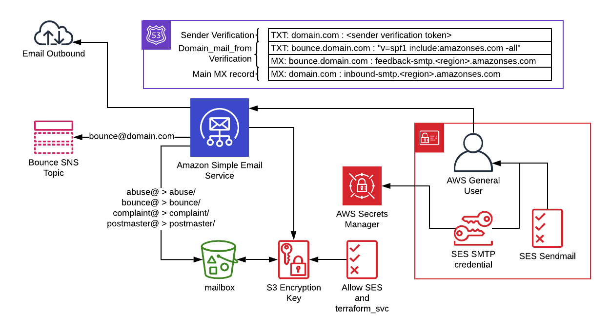
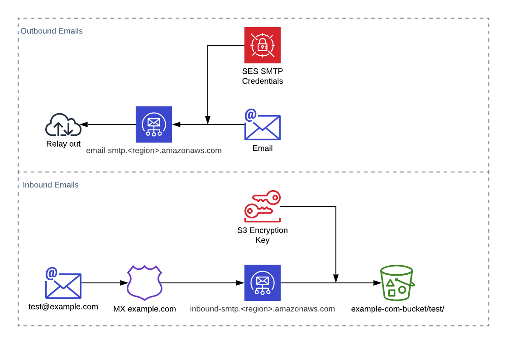

terraform-aws-ses-smtp-relay
==============================
Overview
--------
This module provides the necessary requirements to use Simple Email Service (SES) as an SMTP relay.

Process
-------
Once set up, SES endpoints will relay email sent to them through SMTP. Please [see the AWS docs on configuring your application to use SMTP](https://docs.aws.amazon.com/ses/latest/DeveloperGuide/send-email-smtp.html). An SES credential for these endpoints is created by this module. Credentials for it are stored in SecretsManager.

Inbound emails are all sent to an S3 bucket. Each mailbox is a prefix in the bucket created here. All messages are stored by their UUID and are readable by outlook by adding .eml to the end of them. Only a very basic subset of expected emails are created here. Further inboxes will need to be added to the current active rule set. Flow for both Inboud and Outbound emails shown below:

Bounces and complaints are handled by the SNS topics named ses_bounce_notifications and ses_complaint_notifications respectively. These have to be manually subscribed to as terraform cannot create [SMTP SNS subscriptions](https://www.terraform.io/docs/providers/aws/r/sns_topic_subscription.html)

It is also important to note that all AWS accounts are placed in an "SES Sandbox" by default. This limits you to 200 emails in a 24 hour period. If you wish to go above this limit you will need to raise a support case with AWS support. [See the AWS docs on SES Sandbox](https://docs.aws.amazon.com/ses/latest/DeveloperGuide/request-production-access.html). This module should satisfy all the requirements AWS has around domain verification and basic mail handling once you subscribe to the bounce and complaint SNS topics created here. Monitoring these is important as excessive bounces or complaints can affect your account's SES health and I'm not sure what restrictions are put in place on unhealthy accounts. Please note that terraform cannot create SMTP SNS subscriptions because no ARN is provided until the subscription is confirmed so it cannot handle state. [See the terraform docs for more info](https://www.terraform.io/docs/providers/aws/r/sns_topic_subscription.html)

All MX and TXT records besides the MX for the sender domain is in place for validation that we either own the domain, can send with the domain, or can receive with the domain.

Usage
-----
The module expects the following inputs.

## Inputs

| Name | Description | Type | Default | Required |
|------|-------------|:----:|:-----:|:-----:|
| domain\_mail\_from\_ttl | TTL of domain\_mail\_from records used to validate being able to set the MAIL FROM field | string | `"300"` | no |
| region | Name of the region being deployed into. Used to differentiate regions in SES endpoint MX records so must be either us-east-1, us-west-2, or eu-west-1 | string | n/a | yes |
| sender\_domain | Domain of emails services will be using to send emails through SES (needed for SES domain verification) | string | n/a | yes |
| ses\_sender\_verification\_txt\_ttl | TTL of the TXT record used by SES to verify domain ownership | string | `"600"` | no |
| terraform\_svc\_user | Name of the IAM user terraform uses to administer resources in this account | string | `"terraform_svc"` | no |
| tlz\_org\_account\_access\_role | Name of the IAM role used by shared services to administer cross account resources | string | `"tlz_avm_automation"` | no |

